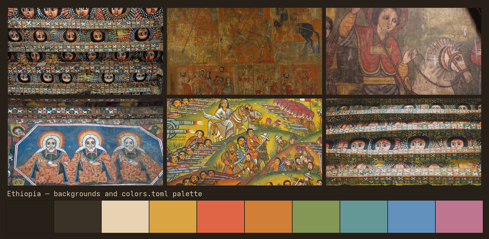

# Ethiopia — an Omarchy theme

A warm, earthen theme for [Omarchy](https://omarchy.org), built from Ethiopian
Orthodox church painting: the cherub ceilings of Gondar, the rock-hewn churches
of Lalibela, illuminated Gospel panels, and the folk narrative canvases of the
Battle of Adwa.

The palette is sampled from the paintings themselves — umber ground, parchment,
church gold, terracotta, indigo and olive — then tuned so every ANSI colour
clears 4.5:1 contrast against the background.



## Install

```bash
omarchy theme install https://github.com/Eyasuk/omarchy-ethiopia-theme.git
omarchy theme set ethiopia
```

`omarchy theme install` clones into `~/.config/omarchy/themes/ethiopia`.
`omarchy theme bg next` cycles the six backgrounds.

To update later:

```bash
omarchy theme update
```

## Palette

| Role | Hex | | Role | Hex |
|---|---|---|---|---|
| `background` | `#262019` | | `red` | `#e06547` |
| `dark_background` | `#1e1914` | | `yellow` | `#d9a441` |
| `darker_background` | `#17130f` | | `orange` | `#d17f36` |
| `lighter_background` | `#3b3227` | | `green` | `#849755` |
| `foreground` | `#e7d3b1` | | `cyan` | `#649896` |
| `light_foreground` | `#cdb78f` | | `blue` | `#6291bd` |
| `dark_foreground` | `#8a7355` | | `magenta` | `#be7690` |
| `bright_foreground` | `#f5e6c8` | | `brown` | `#6d4a2c` |
| `accent` | `#d9a441` | | `selection` | `#4a3e30` |

The ground is deliberately a *warm near-neutral* rather than a saturated brown:
the umber hue is kept, the brown pigment pulled back to ~0.34 saturation, so it
reads warm on a large screen instead of chocolate.

Hyprland's active border is a gold gradient (`#d9a441` → `#efc05c` at 45°),
set from `colors.toml` rather than a `hyprland.lua`, so it survives installation
from this repo.

Icons: `Yaru-wartybrown`.

## What's in here

```
colors.toml          the palette — everything else is generated from it
icons.theme          Yaru-wartybrown
backgrounds/         six 2560x1440 crops of Ethiopian paintings
unlock.png           Plymouth boot/unlock logo, in the theme's gold
preview-unlock.png   preview for Style > Unlock
CREDITS.md           per-image attribution and licensing
```

There is intentionally no `hyprland.lua`, `neovim.lua`, `vscode.json` or
terminal config: Omarchy strips those from any theme installed from a repo
(they run code), and it generates better ones from `colors.toml` anyway —
Neovim gets a full `aether.nvim` palette, VS Code a full generated theme.

## Licence

The theme configuration — `colors.toml`, `icons.theme`, `README.md` — is MIT,
see [LICENSE](LICENSE).

**The backgrounds are not.** They are photographs of real artworks, under
their own licences, and four of the six require attribution if you redistribute
them. One (`1-angelic-ceiling-gondar.jpg`) is CC BY-SA 2.0, which means a
modified version of *that image* must stay CC BY-SA 2.0. See
[CREDITS.md](CREDITS.md) for the per-file breakdown before you reuse them.
